# AI Maze Solver
#### **Collaborators:** [Ahmed Salah Shalabi](https://github.com/AhmedShalabi01), [Jalal Assaly](https://github.com/Jalal-Assaly) and Hazim Ali Abdelazim

## **Introduction** 

Mazes  have  fascinated  people  for  centuries  and  come  in  different  forms,  sizes,  and materials. They challenge participants to find their way through a complex network of paths, walls, and dead-ends to reach the center or exit. In computing terms, a maze is a network consisting of vertices (points) linked by edges (paths). The purpose of maze-solving is to discover the shortest path from one vertex to the next while avoiding obstacles and dead ends. 

The A\* algorithm is a commonly used approach to maze-solving that employs a **heuristic evaluation function**. A heuristic function is a shortcut to solving a problem when there are no exact solutions for it or the time to obtain the solution is too long, to direct the search for the ideal path. In other words, a heuristic function estimates the distance between the agent and the goal in order to guide the decision-making of the agent in a more precise way. A\* is commonly used in robotics, game development, and other disciplines where fast pathfinding is required. 

A\* works by maintaining two lists of vertices - the open list and the closed list - and repeatedly selecting the vertex with the lowest total cost (the sum of the cost to reach the vertex and the estimated cost to reach the goal) from the open list and adding its neighbors to the open list if they have not already been explored. 

One of the most important advantages of the A\* algorithm is that it may avoid researching pathways that are unlikely to lead to the objective, making it more efficient than other search algorithms. Nevertheless, the efficiency of the heuristic function can have a significant impact on the algorithm's performance. If the heuristic is too optimistic, A\* may spend time exploring nodes that eventually go nowhere. If the heuristic is very pessimistic, A\* may overlook shorter pathways that are further away from the beginning vertex but closer to the target. 

## **Implementation** 
### **Development Tools** 

The A\* algorithm for maze-solving was implemented in **Python 3.10** using object-oriented programming (OOP) techniques. The code was developed using the **Visual Studio Code IDE**. 

### **Maze Design** 

The maze was represented as a **2D grid of cells**, using the *pyamaze.py* module, built on top of the *Tkinter* library for graphical interfacing of desktop applications. The maze is composed of square cells where each cell is assigned a set of **x and y coordinates** in a tuple structure. The walls and borders of the maze are determined by a *maze\_map* dictionary. It uses the cells’ coordinates as keys and another dictionary of allowable moves as values to represent the available cardinal directions. An **open path** is represented as **1** (True) and a **wall or maze border** is represented as **0** (False). This is a sample of the maze\_map dictionary:  

**maze\_map** = { (1, 1): {'N': False, 'S': True, 'E': True, 'W': False}, (1, 2): {'N': False, 'S': True, 'E': True, 'W': False}, (1, 3): {'N': False, 'S': True, 'E': False, 'W': False}…} 

### **Environment Description** 

**Partially Observable:** The agent is only aware of the cells surrounding its current position at each point in time. 

**Deterministic:** The next state of the agent is only determined by the choice it makes at the current state it is located at. 

**Sequential:** Each cell can only be reached thanks to a previous sequence of moves. 

**Static:** The maze does not change while the agent is deliberating on the next move to make. **Discrete:** Every sequence of percepts and actions is clearly defined by a start and an end. **Single Agent:** Only one agent is trying to find the path to the goal. 

### **A\* Implementation** 

The A\* algorithm was implemented as a function in a custom module named *a\_star.py*. It keeps  track  of  each  cell’s  **total  (f)**,  **actual  (g)**  and  **heuristic  (h)**  cost  in  three  separate dictionaries. Using the *PriorityQueue()* class from the built-in library called *queue.py*, the A\* function keeps track of the open list of vertices. Each vertex is represented as a tuple of three items: **the total cost**, **heuristic cost** and **current cell’s coordinates** tuple. The heuristic function used is the **Manhattan distance**, which calculates the distance between the agent’s current cell and the goal cell by summing the absolute differences of their x and y coordinates. Note that the agent always starts from the center (6,6) of the 11x11 maze and aims for the goal that is located in a random location in the maze, however the agent knows it. 

### *State Space of 11x11 maze with all cardinal moves allowed (NSEW)* 

The state space consists of a simple **11x11 maze** with no obstacles. So, it has 121 cells where each cell can be either blocked or unblocked, resulting in a state space of **2121 possible configurations**.  Note  that  this  simplified  estimate  does  not  take  into  consideration  any constraints or rules of maze generation. In practice, the size of the state space can be reduced by carefully designing the maze and using efficient algorithms such as A\* to explore only the most promising paths. Additionally, techniques such as pruning and caching can be used to further reduce the size of the state space and improve the efficiency of the algorithm. 

### *State Space of 11x11 maze with moves at the intersection of two corridors*
The size of the state space would depend on the number and locations of intersections in the maze. In an n-by-n maze, assuming there are multiple corridors and intersections, the number of intersections can be approximated to **(n-2)2**. This approximation accounts for the exclusion of the outer walls of the maze, which cannot be intersections. For an 11 by 11 maze, the state space size would be **(11-2)2 = 81**.** 

## **Flowchart** 

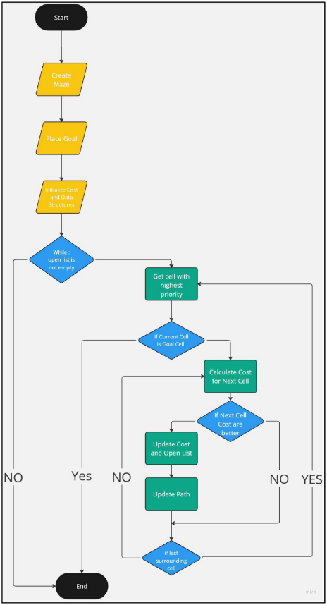

## **Algorithm** 
1. **Define** the starting cell of the agent and the goal cell it aims to reach. In this example *(see figure 1),* the goal cell is located at position (1,1) and the start cell is at location (4,4). 

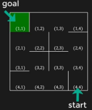

2. **Initialize** the ***g\_cost*** of the start cell with** 0 and the ***h\_cost*** with the heuristic function of the start cell. The ***f\_cost*** of start cell is going to be the summation of both ***g*** and **h**. In this example *(see figure 2)*, ***g\_cost = 0***, ***h\_cost = 6***; hence, ***f\_cost = 0 + 6 = 6***. 

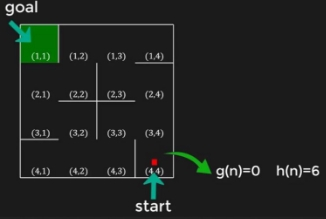

**Figure 2** 

3) **Initialize** the ***g\_costs***, ***h\_costs*** and ***f\_costs*** of all remaining cells with infinity. 

**Figure 3** 

4) **Create** the ***open\_list*** using a priority queue data structure and add the starting cell with its ***f\_cost***, ***h\_cost*** and ***coordinates tuple***. 
4) **Create** the dictionaries and lists for path memorization.  
1. ***srchPath*** stores the cells that are added to the graph. 
1. ***rvrsPath*** stores the shortest path from the **goal** to the **start cell**. 
1. ***fwdPath*** stores the shortest path from the **start** **cell** to the **goal**. 
6) **While** the ***open\_list*** is not empty:  
1. **Get** the cell with lowest ***f\_cost*** from the open list. 
1. If the current cell is the goal, **break**. 
1. Else, **explore** all neighboring cells that are not walls. 
1. For each neighboring cell:  
   1. Calculate the ***g\_cost**, **h\_cost*** and ***f\_cost*** *(see figures 5 & 6)*. 
   1. If the ***f\_cost*** is lower than the current value for that cell in the dictionary of costs, update all costs and add them to the ***open\_list***. 
1. Add the cell to the ***rvrsPath*** as a candidate. 

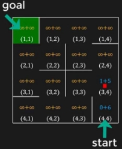 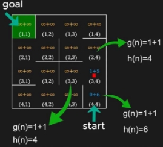

**Figure 4  Figure 5** 

7) Deduce the forward path ***fwdPath*** from the reversed path ***rvrsPath*** and return all three paths form the algorithm. 
5. **Results** 

   **Step 0:** Build the maze 

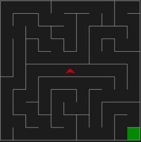

**Figure 6:** Starting Maze configuration** 

**Step 1:** Agent examines the cells’ total cost ***f\_cost*** until it finds the goal. 

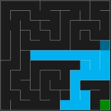 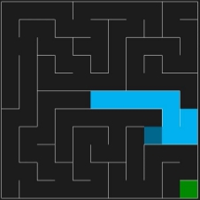

**Figure 7  Figure 8 Step 2:** Agent found the goal and traces its way back to the starting goal. 

*Robot Maze Solver Report  | CSE464a | Spring 2023* 

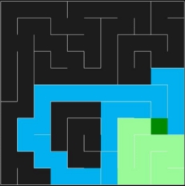

**Figure 9** 

**Step 3:** Agent moves towards the goal.  

**Figure 11** 

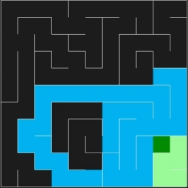

**Figure 10** 

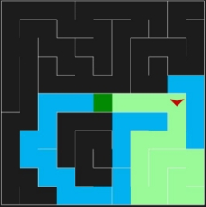

**Figure 12** 

*Robot Maze Solver Report  | CSE464a | Spring 2023* 

6. **Testing** 

The testing part of this program was conducted in a separate file called *test\_maze\_solver.py* by  a  custom  class  called  *AStarAlgTestCase()*  that  inherits  the  functions  from  *TestCase.py* module that can be found in the *unittest.py* library. 

**Test Case 1:** Behavior of the A\* function when executed on a normal 11x11 maze. 

def test\_aStarAlg(self): 

- Call the A\* algorithm 

`        `srchPath, rvrsPath, fwdPath = aStarAlg(self.myMaze) 

- Assertions 

self.assertIsInstance(srchPath, list) self.assertIsInstance(rvrsPath, dict) self.assertIsInstance(fwdPath, dict) 

- Start position should be in the search path self.assertIn((1, 1), srchPath) 
- Goal position should be in the search path 

`        `self.assertIn((self.myMaze.rows, self.myMaze.cols), srchPath) 

- Start position should be in the forward path self.assertIn((1, 1), fwdPath) 
- Goal position should be in the forward path 

`        `self.assertIn((self.myMaze.rows, self.myMaze.cols), fwdPath) 

The *test\_aStarAlg()* function executes seven unit test cases: 

- The set of *assertIsInstance()* ensures that the data types of the returned paths of the A\* function are indeed a list, and two dictionaries. 
- The set of *assertIn()* functions ensures that the start and goal positions exist in the forward and search paths. 

All tests were successful ! 

**Test Case 2:** Behavior of the A\* function when executed on a large 101x101 maze. 

def test\_aStarAlg\_large\_maze(self): 

- Create a large maze 

`        `largeMaze = maze(101, 101) 

`        `largeMaze.CreateMaze(largeMaze.rows, largeMaze.cols) 

- Create start cell and goal cell 

`        `start = (51, 51) 

`        `goal = (random.randint(1, 101), random.randint(1, 101)) 

- Call the A\* algorithm on the large maze 

`        `srchPath, rvrsPath, fwdPath = aStarAlg(largeMaze, start, goal) 

- Assertions 

self.assertIsInstance(srchPath, list) self.assertIsInstance(rvrsPath, dict) self.assertIsInstance(fwdPath, dict) 

- Start position should be in the search path self.assertIn(start, srchPath) 
- Goal position should be in the search path self.assertIn((goal[0], goal[1]), srchPath) 
- Start position should be in the forward path self.assertIn(start, fwdPath) 
- Goal position should be in the forward path self.assertIn((goal[0], goal[1]), fwdPath)

The same set of sets are executed with the exception that a large 101x101 maze needs to be created in order to run the set of assertions. All tests were successful ! 

**Test Case 3:** Behavior of the A\* function when executed on a normal 11x11 maze with the maximum allowed number of possible paths to the solution. The number of paths possible is handled by the *loopPercent* parameter of the *CreateMaze()* function, where 100 is the maximum number of paths. 

def test\_aStarAlg\_many\_paths(self): 

- Create a maze without any obstacles 

`        `emptyMaze = maze(11, 11) 

`        `emptyMaze.CreateMaze(emptyMaze.rows, emptyMaze.cols, loopPercent=100) 

- Create start cell and goal cell 

start = (6, 6) 

goal = (random.randint(1, 11), random.randint(1, 11)) 

- Call the A\* algorithm on the empty maze 

srchPath, rvrsPath, fwdPath = aStarAlg(emptyMaze, start, goal) 

- Assertions 

self.assertIsInstance(srchPath, list) self.assertIsInstance(rvrsPath, dict) self.assertIsInstance(fwdPath, dict) 

- Start position should be in the search path self.assertIn(start, srchPath) 
- Goal position should be in the search path self.assertIn((goal[0], goal[1]), srchPath) 
- Start position should be in the forward path self.assertIn(start, fwdPath) 
- Goal position should be in the forward path self.assertIn((goal[0], goal[1]), fwdPath)

The same set of assertions are run again. All tests were successful ! 

7. **Conclusion** 

In conclusion, our project was a success. To explore the maze and discover the best path, the A\* algorithm with a Manhattan distance heuristic has been used. The implementation was efficient enough so large mazes could be easily and timely computed. Our implementation of the A\* algorithm is suitable for mazes that include more than one possible path to the goal. 

Overall, we are very satisfied with our results and have learned a lot from this project. We are  interested  in  looking  further  into  search  algorithms  and  explore  much  more  difficult problems. 

8. **References** 

[1]: M. A. Naeem, “A-Star (A\*) Search for Solving a Maze using Python (with visualization),” Medium, Oct. 26, 2021.[ https://levelup.gitconnected.com/a-star-a-search-for- solving-a-maze-using-python-with-visualization-b0cae1c3ba92 ](https://levelup.gitconnected.com/a-star-a-search-for-solving-a-maze-using-python-with-visualization-b0cae1c3ba92) 

[2]: M. A. Naeem, “A Python Module for Maze Search Algorithms,” Medium, Sep. 24, 2021. [https://towardsdatascience.com/a-python-module-for-maze-search-algorithms-64e7d1297c96 ](https://towardsdatascience.com/a-python-module-for-maze-search-algorithms-64e7d1297c96) 

[3]: “qmaze,” www.samyzaf.com.[ https://www.samyzaf.com/ML/rl/qmaze.html ](https://www.samyzaf.com/ML/rl/qmaze.html) 

[4]: M. Ebrahim, “Python Priority Queue (Step By Step Guide),” Aug. 18, 2022. [https://likegeeks.com/python-priority-queue/ ](https://likegeeks.com/python-priority-queue/)(accessed May 19, 2023). 

**Image References:** 

**Figures 1 to 5** were extracted from[ https://levelup.gitconnected.com/a-star-a-search-for- solving-a-maze-using-python-with-visualization-b0cae1c3ba92 ](https://levelup.gitconnected.com/a-star-a-search-for-solving-a-maze-using-python-with-visualization-b0cae1c3ba92)
*Robot Maze Solver Report  | CSE464a | Spring 2023* 
